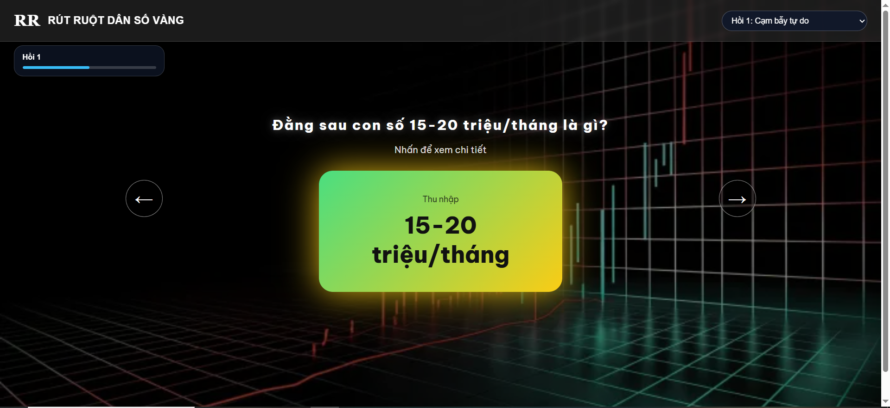
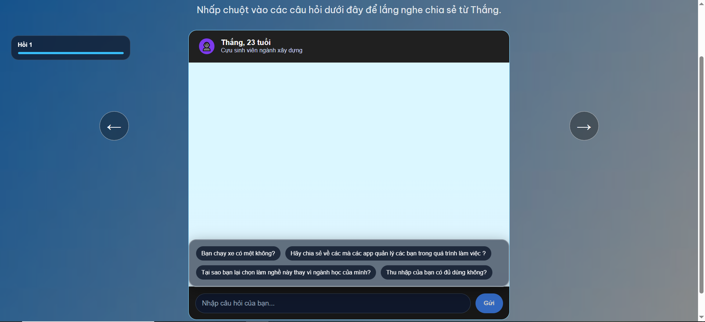
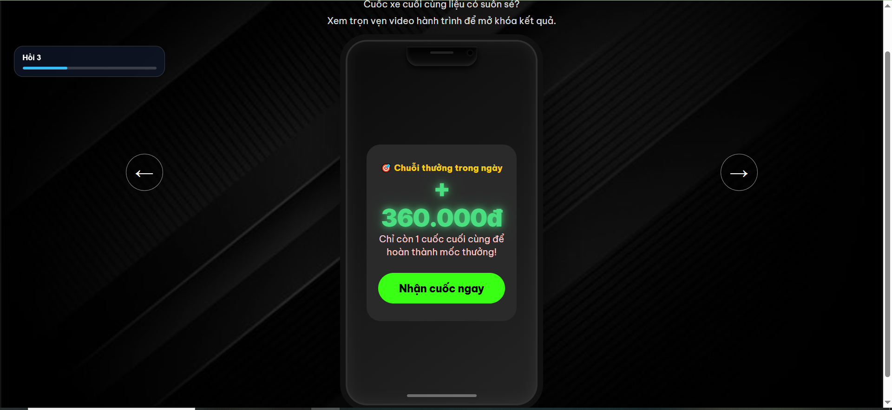
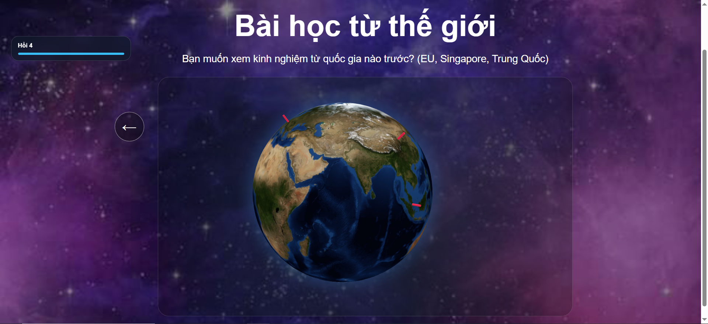

# "Rút ruột" dân số vàng — The Human Cost Behind the Gig Economy

An interactive **scrollytelling** story (long-form data journalism) about the social security gap facing gig-economy workers (ride-hailing and delivery drivers) in Vietnam. Readers move through a sequence of "scenes" using the arrow keys or nav buttons, and each scene uses a different presentation format: background video, charts, interactive simulations, a simulated chat, a 3D globe, and more.

**Live demo:** [the-demographic-dividend-trap.vercel.app](https://the-demographic-dividend-trap.vercel.app)

## Screenshots

| Cover scene | Income stat reveal | Simulated chat |
|---|---|---|
|  |  |  |

| Video scene | Algorithm trap simulation | Interactive globe |
|---|---|---|
|  |  |  |

## Key Features

- **Chapter-based navigation**: 6 chapters — Intro, Acts 1–5 — each made up of several sub-scenes, navigated with `←` `→` keys or on-screen buttons.
- **Chapter progress bar** (`chapter-timeline`) showing how far through the current chapter the reader is.
- **Dynamic backgrounds**: each scene can use a video (`.mp4`) or an image background, auto-detected from the file extension.
- **Multiple interactive scene types**:
  | Type (`type`) | Component | Description |
  |---|---|---|
  | `cover` | `SceneIntro.jsx` (`CoverScene`) | Cover page / opening quote |
  | `stats` | `SceneStats.jsx` | Stat cards that pop in on click |
  | `chat` | `SceneChat.jsx` | Simulated Q&A chat with a character |
  | `timeline` | `SceneTimeline.jsx` | Age-group tabs with a typewriter effect once all are viewed |
  | `compare` | `SceneSliderCompare.jsx` | Old law vs. new law comparison |
  | `choices` | `GlobeScene.jsx` | 3D globe (react-globe.gl) for picking a country |
  | `calculator` | `SceneCalculator.jsx` | Calculator estimating social insurance contributions from income |
  | `driverSim` | `SceneDriverSim.jsx` | Simulation of the income vs. health vs. social-insurance trade-off by hours worked |
  | `algorithmTrap` | `SceneAlgorithmTrap.jsx` | Interactive video scenario simulating the "algorithm trap" |
  | `video` | `SceneVideo.jsx` | Full-screen video playback |
  | `picture` | `ScenePicture.jsx` | Illustrative image display |
  | `donut` | `SceneDonut.jsx` | Donut chart of insurance contribution ratios, with hover tooltips |

## Tech Stack

- **React 18** (function components + hooks: `useState`, `useEffect`, `useMemo`)
- **Vite** (entry point `main.jsx` using `createRoot`)
- **react-globe.gl** for the 3D globe in the country-selection scene
- Plain CSS, split into two files: `index.css` (base styles / shared layout) and `App.css` (per-scene styles)

## Project Structure

```
├── src/
│   ├── App.jsx                  # Root component: navigation, renders scenes from storyData
│   ├── App.css                  # Per-scene-type styles
│   ├── index.css                # Base styles / shared layout
│   ├── main.jsx                 # React entry point
│   ├── data/
│   │   └── storyData.js         # All story content (text, backgrounds, next/prev, questions...)
│   └── components/
│       ├── GlobeScene.jsx
│       ├── NavArrows.jsx        # PrevArrow / NextArrow
│       ├── SceneAlgorithmTrap.jsx
│       ├── SceneCalculator.jsx
│       ├── SceneChat.jsx
│       ├── SceneDonut.jsx
│       ├── SceneDriverSim.jsx
│       ├── SceneGlobalMap.jsx   # ChoicesScene (currently unused in App.jsx)
│       ├── SceneIntro.jsx       # CoverScene
│       ├── ScenePicture.jsx
│       ├── SceneSliderCompare.jsx
│       ├── SceneStats.jsx
│       ├── SceneTimeline.jsx
│       └── SceneVideo.jsx
├── public/
│   └── pictures/                # Local background images referenced by storyData.js (paths like /pictures/...)
└── docs/                        # README screenshots
```

## Getting Started

```bash
# Install dependencies
npm install

# Run the dev server
npm run dev

# Build for production
npm run build

# Preview the production build
npm run preview
```

## Adding a New Scene

1. Add a new object to `src/data/storyData.js` with a unique `id`, along with `type`, `title`/`text`, `bg`, and `prev` / `next` links to other scenes.
2. If the `type` doesn't already exist, create a matching component in `src/components/` and register a new case in the `renderScene()` function in `App.jsx`.
3. Add any needed CSS classes to `App.css` (per-scene styles) or `index.css` (shared styles).

## Content & Data Sources

The story content (statistics, interview quotes) lives in `storyData.js`, drawing on data about gig-economy labor, Vietnam's 2024 Social Insurance Law, and international case studies (Singapore, China, EU). Verify and refresh figures and quotes before using this content for official publication.